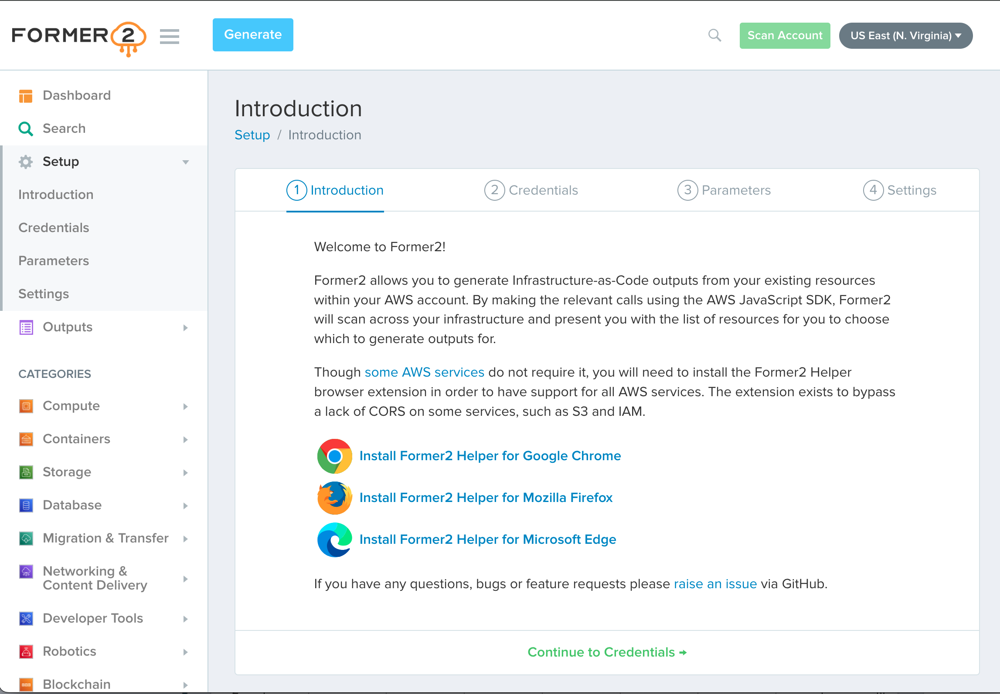

# Former2

Former2 allows you to generate Infrastructure-as-Code outputs from your existing resources 
within your AWS account. By making the relevant calls using the AWS JavaScript SDK, 
Former2 will scan across your infrastructure and present you with the list of resources 
for you to choose which to generate outputs for

## Screenshot Sample
<p align="center">



## GitHub Project Page

https://github.com/iann0036/former2.git

## How-To 

```
## view/edit Dockerfile

## build image
docker build -t former2 .

## run container
docker container run --name former2 --detach --publish 5000:80 former2:latest

```

```
## access container
curl http://127.0.0.1:5000

```

```
## teardown container
docker container rm -f $(docker container ls -aq -f name=former2) 

## teardown image
docker image rm -f $(docker image ls -aq -f reference='former2*') 

```

## Live Demo

https://former2.com

